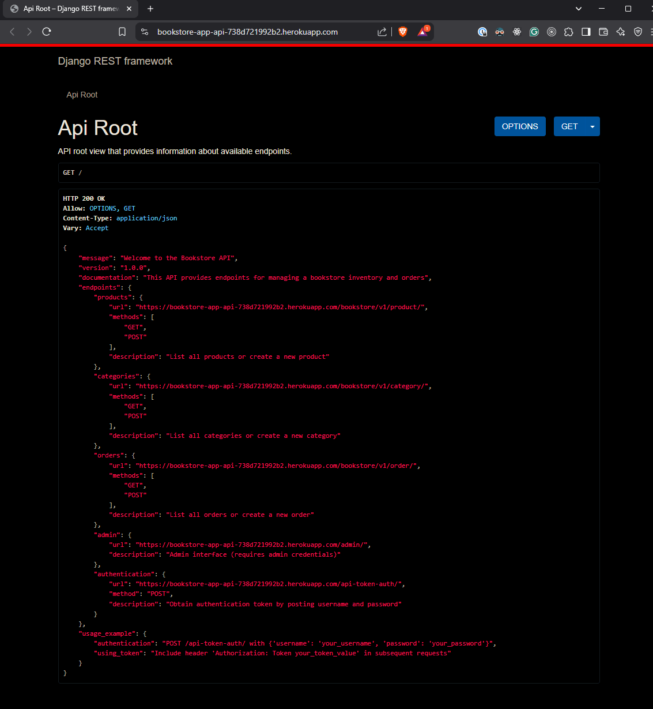
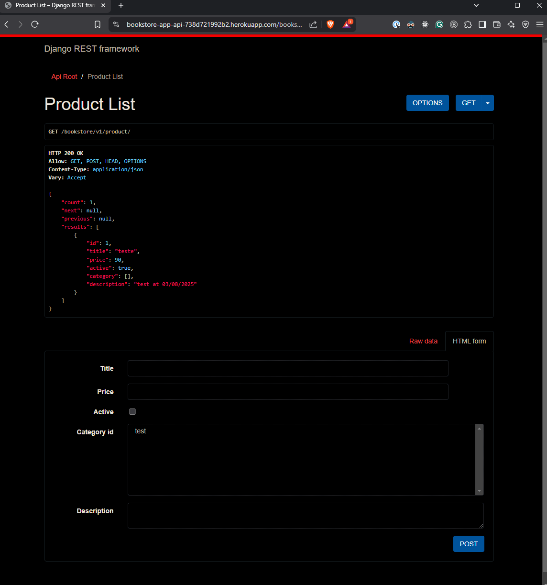
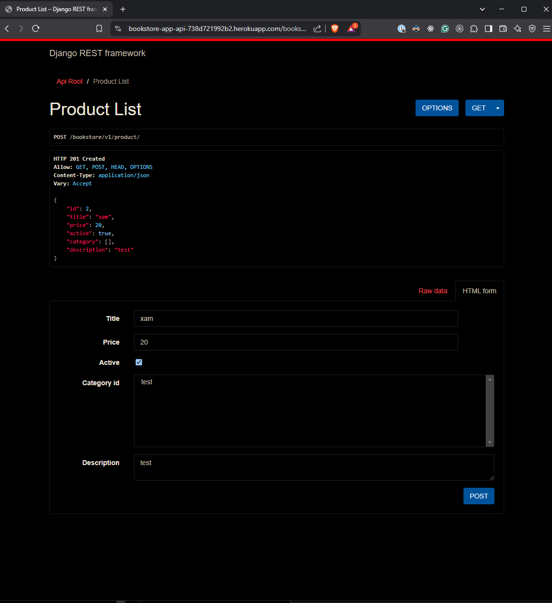
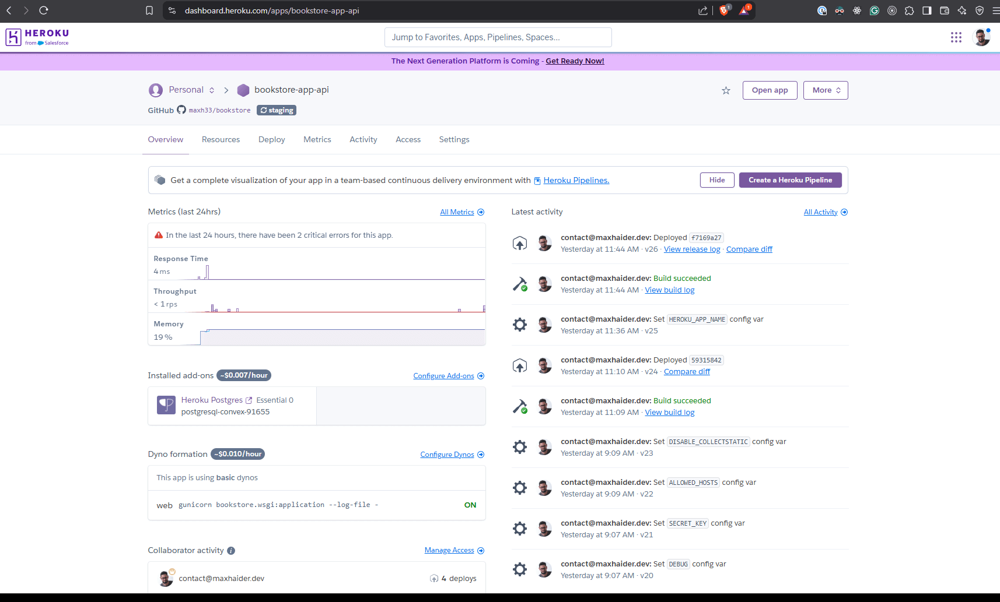
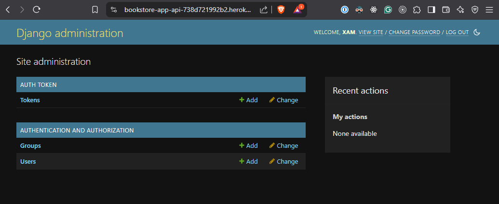

# Bookstore

Bookstore APP from Backend Python

## Overview

The Bookstore application is a backend service built with Django that allows users to manage a bookstore inventory and orders. It provides a RESTful API for interacting with products and orders, along with an admin interface for managing the application.

## Features

- User authentication with token-based authentication
- CRUD operations for products and categories
- Order management
- Admin interface for managing the bookstore
- Docker support for easy deployment and development

## Tech Stack

- **Backend**: Django 5.1.7
- **Database**: PostgreSQL
- **Containerization**: Docker
- **Dependency Management**: Poetry
- **Testing**: Django's built-in test framework, REST framework for API testing

## Core Technologies

- Django REST Framework for building APIs
- PostgreSQL for data storage
- Docker for containerization
- Whitenoise for serving static files

## Project Demo

- **Deployment Link**: [Bookstore App on Heroku](https://bookstore-app-api-738d721992b2.herokuapp.com/)
- **Admin Panel**: Access the admin panel at [Admin Interface](https://bookstore-app-api-738d721992b2.herokuapp.com/admin/)
- **Images**: 
  - 
  - 
  - 
  - 
  - 

## Deployment Infrastructure Workflow

The application is deployed on Heroku using a CI/CD pipeline that automatically deploys changes from the main branch after passing tests.

## How to Run

1. Clone this project

   ```shell
   git clone github.com/maxh33/bookstore
   ```

2. Install dependencies:

   ```shell
   cd bookstore
   poetry install
   ```

3. Run local dev server:

   ```shell
   poetry run manage.py migrate
   poetry run python manage.py runserver
   ```

4. Run docker dev server environment:

   ```shell
   docker-compose up -d --build 
   docker-compose exec web python manage.py migrate
   ```

5. Run tests inside of docker:

   ```shell
   docker-compose exec web python manage.py test
   ```

